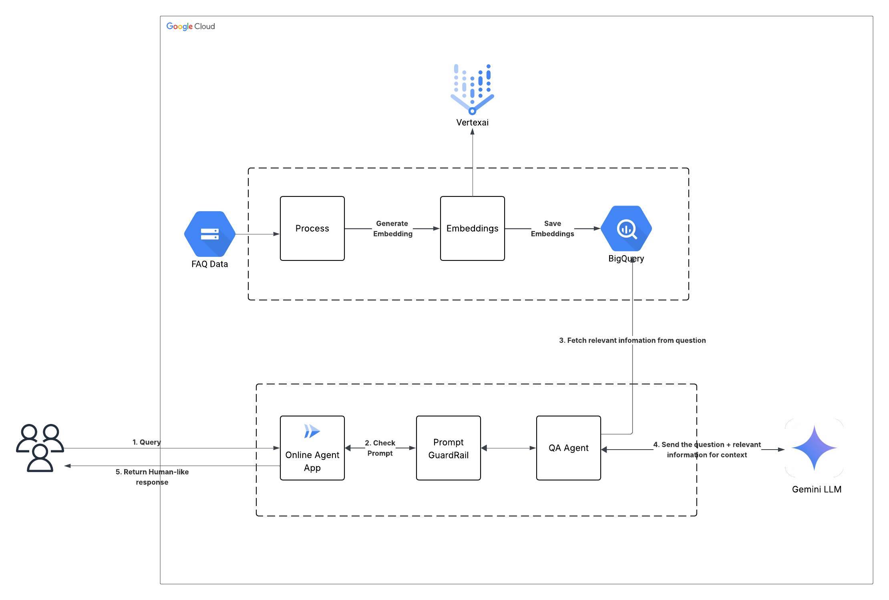
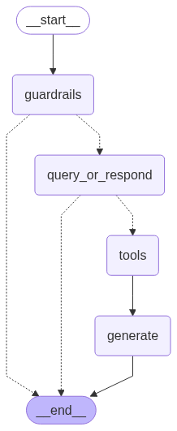
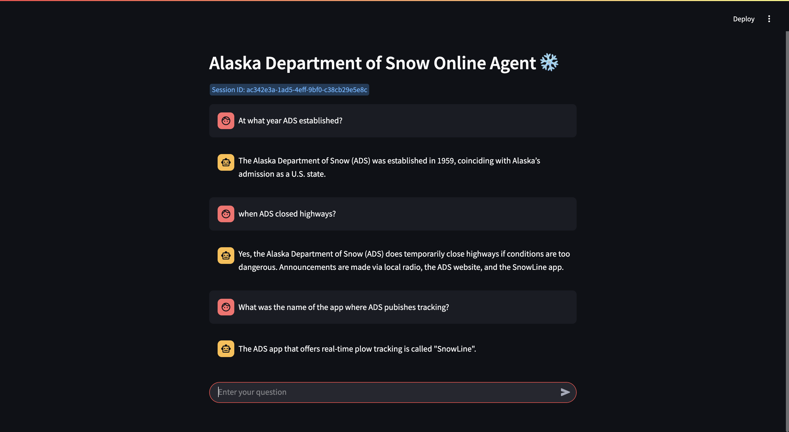

# Challenge 5: Alaska Department of Snow Online Agent

#### Goal: Demonstrate your ability to create a secure, accurate, production-quality generative AI agent that can be deployed online

## Overview

The Alaska Department of Snow (ADS) serves a population of 750,000 across 650,000 square miles. During snow forecasts, regional offices receive high volumes of inquiries about snow plowing, school closures, and service disruptions. To improve scalability and service delivery, ADS is developing an online AI-powered chatbot to offload routine and repetitive queries.

---

## System Architecture



### Key Components

1. **Backend Data Store for Retrieval-Augmented Generation (RAG)**

- FAQ data is sourced from Google Cloud Storage (GCS), transformed into embeddings using Vertex AI, and stored in BigQuery along with the original text for semantic querying.

2. **Generative AI Agent**

- Built with the LangGraph framework, the AI agent consists of modular sub-agents designed to handle routing, filtering, and generation tasks.
- The user interface is developed with Streamlit and deployed on Cloud Run.

#### Sub-Agent Breakdown

- **Guardrails Agent**: Validates user questions and filters out irrelevant or unsafe inputs.
- **QA Agent**: Uses context-relevant information retrieved from BigQuery to provide accurate, grounded answers via the LLM.

---

## Agent Workflow (LangGraph)



1. **guardrails**  
   Validates the user query. If the query is not relevant to ADS operations, the agent responds with an appropriate message and halts further processing.

2. **query_or_respond**  
   Checks the history for existing context. If insufficient, proceeds to answer the question instead of querying BigQuery embeddings.

3. **tools**  
   Interfaces with BigQuery to retrieve semantically relevant FAQs and append them to the agent state.

4. **generate**  
   Uses the gathered context and question to generate a coherent, accurate, and grounded response via an LLM.

---

## Deployment Instructions

### Step 1: Prepare BigQuery Table and Embeddings

Use the `bq_vector_store.ipynb` notebook to:

- Create a BigQuery table
- Load the FAQ CSV
- Generate and store embeddings using Vertex AI

Once completed, the application will be able to serve queries based on the stored FAQ knowledge base.

---

### Step 2: Configure Service Accounts for Secure Access

Service accounts are used to enable secure access to BigQuery and Vertex AI from Cloud Run.

#### Set variables:

```bash
PROJECT_ID=$(gcloud config get-value project)
REGION=us-central1  # change if needed
SA_NAME=alaska-online-agent-sa
```

#### Create and configure service account:

```bash
gcloud iam service-accounts create $SA_NAME --display-name "Cloud Run Service Account"
gcloud projects add-iam-policy-binding $PROJECT_ID \
  --member="serviceAccount:$SA_NAME@$PROJECT_ID.iam.gserviceaccount.com" \
  --role="roles/aiplatform.user"
gcloud projects add-iam-policy-binding $PROJECT_ID \
  --member="serviceAccount:$SA_NAME@$PROJECT_ID.iam.gserviceaccount.com" \
  --role="roles/bigquery.dataOwner"
```

---

### Step 3: Deploy the Application on Cloud Run

Create a artifact registry and push the application container image to the registry.

#### Enable required services:

```bash
gcloud services enable run.googleapis.com artifactregistry.googleapis.com
```

#### Set deployment variables:

```bash
PROJECT_ID=$(gcloud config get-value project)
REGION=us-central1  # change if needed
IMAGE_NAME=alaska-dept-of-snow-agent-app
REPO_NAME=alaska-dept-of-snow
```

#### Create Artifact Registry repository:

```bash
gcloud artifacts repositories create $REPO_NAME --repository-format=docker --location=$REGION
```

#### Build and push container image:

```bash
gcloud builds submit --tag $REGION-docker.pkg.dev/$PROJECT_ID/$REPO_NAME/$IMAGE_NAME
```

#### Deploy to Cloud Run:

```bash
gcloud run deploy $IMAGE_NAME \
  --image $REGION-docker.pkg.dev/$PROJECT_ID/$REPO_NAME/$IMAGE_NAME \
  --platform managed \
  --region $REGION \
  --allow-unauthenticated \
  --service-account $SA_NAME@$PROJECT_ID.iam.gserviceaccount.com \
  --port 8080
  --min 1
  --cpu 4
```

---

### Testing

Unit tests are included in the `agent_test.py` file using the unittest framework. These tests cover both positive and negative scenarios to ensure the agent handles a wide range of inputs reliably.

#### To run the tests:

```bash
python agent_test.py
```

---

### Evaluation

The agent is evaluated using Google's Evaluation Service API, with notebook provided in `evaluation.ipynb`. The following metrics are analyzed:

- question_answering_quality
- groundedness
- verbosity
- instruction_following
- safety

---

### App Screenshot



---

### Local Development

For local development, it is recommended to create a virtualenv.

#### Install packages:

```bash
pip install -r requirements.txt
```

#### Run Streamlit app server:

```bash
streamlit run app.py --server.headless true
```

---

### Summary

This project demonstrates how to build and deploy a robust AI assistant tailored for a public service department. It leverages LangGraph, Streamlit, and GCP services like BigQuery and Vertex AI to ensure scalability, relevance, and safety in real-world deployment.
